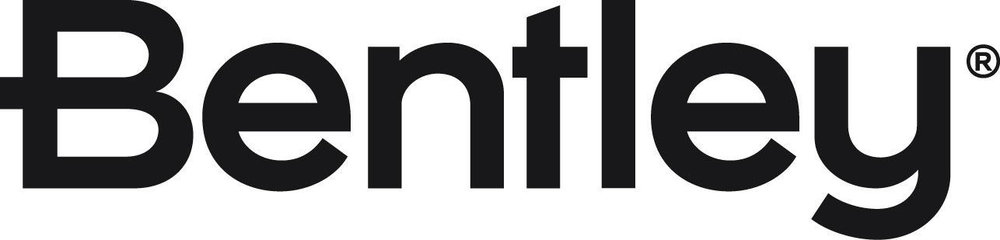

# OWASP Thick Client Application Security Verification Standard (TCASVS)

## はじめに

OWASP Thick Client Application Security Verification Standard (TCASVS) は、シッククライアントアプリケーション (デスクトップソフトウェア、ネイティブアプリケーション、その他ブラウザのサンドボックス外で動作するローカル実行プログラム) を設計、構築、テストするための包括的なセキュリティ要件を提示します。

TCASVS はウェブアプリケーション向けの [OWASP Application Security Verification Standard (ASVS)](https://github.com/OWASP/ASVS) と [Mobile Application Security Verification Standard (MASVS)](https://github.com/OWASP/owasp-masvs) の間のギャップを埋めます。MASVS はシッククライアントのテストに適用できますが、最適なものではありません。TCASVS はシッククライアントのシナリオに特化して策定された標準を提供します。

## 最新安定版 — 5.0.0

標準のソースは [`5.0/ja/`](document/5.0/ja/) にあります。三つの検証レベルにわたる 130 以上のセキュリティ要件をカバーする 6 つの章を含みます。

| 章 | タイトル |
|----|----------|
| V1 | [アーキテクチャと脅威モデリング (Architecture and Threat Modeling)](document/5.0/ja/0x10-V1-Architecture-and-Threat-Modeling.md) |
| V2 | [構築、展開、環境の堅牢化 (Build, Deployment, and Environment Hardening)](document/5.0/ja/0x11-V2-Build-Deployment-and-Environment-Hardening.md) |
| V3 | [データストレージと保護 (Data Storage and Protection)](document/5.0/ja/0x12-V3-Data-Storage-and-Protection.md) |
| V4 | [コード品質とエクスプロイト軽減 (Code Quality and Exploit Mitigation)](document/5.0/ja/0x13-V4-Code-Quality-and-Exploit-Mitigation.md) |
| V5 | [暗号技術 (Cryptography)](document/5.0/ja/0x14-V5-Cryptography.md) |
| V6 | [ネットワーク通信 (Network Communication)](document/5.0/ja/0x15-V6-Network-Communication.md) |

## プロジェクトリーダーとワーキンググループ

本プロジェクトは [Dave Hanson](https://github.com/JeffreyShran) と [Samuel Aubert](https://github.com/matreurai) が主導し、Bentley Systems の AppSec チームの元メンバーおよび現メンバーである [Einaras Bartkus](https://github.com/eb-bsi), [Thomas Chauchefoin](https://www.linkedin.com/in/thomaschauchefoin), [John Cotter](https://www.linkedin.com/in/john-cotter-40338612/) が支援しています。

また、本プロジェクトは OWASP コミュニティおよび OWASP Foundation も支援しています。プロジェクトのディレクターとしての立場で支援いただいた [Starr Brown](https://github.com/mamicidal) に心から感謝します。

## Standard Objectives

- Help organizations adopt or adapt a high quality secure coding standard for thick client applications.
- Help architects and developers build secure thick client software by designing and building security in, and verifying that controls are in place and effective.
- Help security reviewers use a comprehensive, consistent, high quality standard for thick client security assessments, code reviews, and penetration testing.
- Provide a framework for procurement and vendor assessment of thick client application security.

## Contributing

Please [log issues](https://github.com/OWASP/TCASVS/issues) if you find bugs or have ideas. We welcome pull requests based on discussion in issues.

See [CONTRIBUTING.md](CONTRIBUTING.md) for detailed contribution guidelines.

## Contributors

## Sponsors

<a href="https://www.bentley.com/company/about-us/">
  

    
  

  <b>
    Bentley is the leading provider of infrastructure engineering software, advancing infrastructure for better quality of life and sustainability.
  </b>
  

    Visit <u>bentley.com</u> to learn more.
  

</a>

## Star History

## License

The entire project content is under the [Creative Commons Attribution-ShareAlike 4.0 International License](https://creativecommons.org/licenses/by-sa/4.0/).

## Related Projects

- [OWASP Application Security Verification Standard (ASVS)](https://github.com/OWASP/ASVS)
- [OWASP Mobile Application Security Verification Standard (MASVS)](https://github.com/OWASP/owasp-masvs)
- [OWASP Software Assurance Maturity Model (SAMM)](https://github.com/OWASP/samm)
